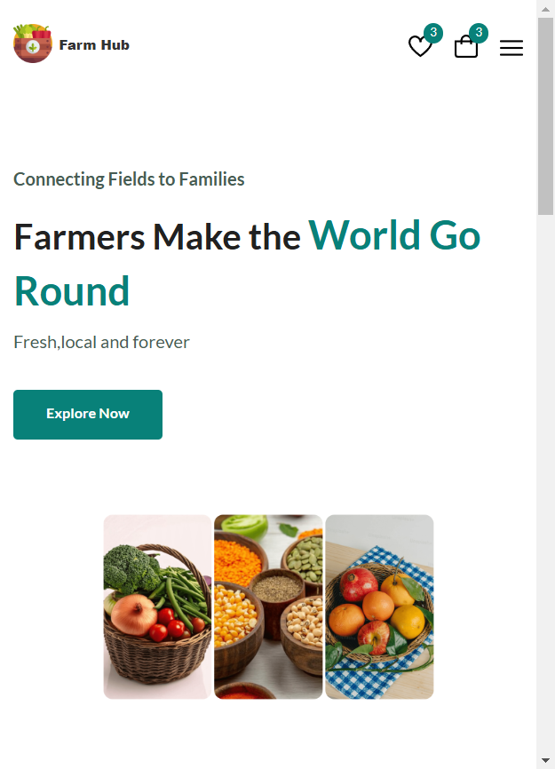
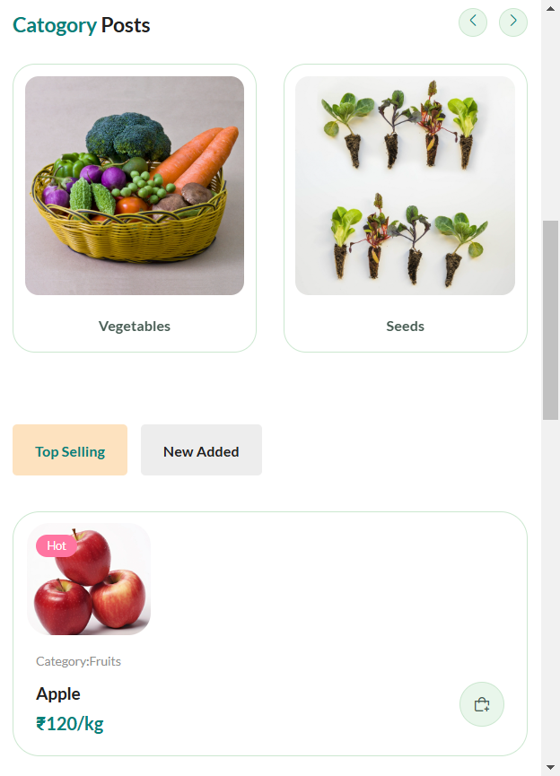
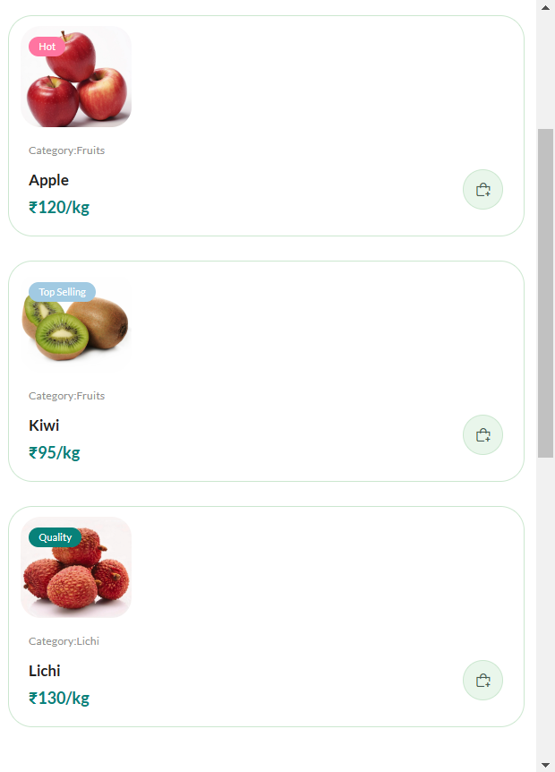

# FarmHub
Farmer Market Place (Connecting Farms to Local Vendors)

## About the Project
FarmHub is a user-friendly platform designed to directly connect farmers with local vendors. By eliminating middlemen, FarmHub fosters transparency and ensures fair pricing for farmers while providing vendors with fresh, locally-sourced products.

The project begins with an onboarding page (onboarding.html), serving as the entry point to all interconnected pages.

## Key Features
Farmer Dashboard: Easy-to-use interface for farmers to list their produce and track sales.
Vendor Dashboard: Browse available products, place orders, and manage purchases.
Direct Communication: Enable real-time messaging or notifications between farmers and vendors.
Secure Transactions: Streamlined payment integration for hassle-free transactions.
Responsive Design: Accessible on both mobile and desktop devices.
Getting Started
Follow these instructions to set up and run FarmHub locally.

## Prerequisites
A modern web browser (Chrome, Firefox, etc.)

## Run the Project File
  1. Run on Live Server Extension or any other Server
```
 2. Initial or First Page is the Onboarding Page (onborading.html)

```
## Installation
Clone the repository:
   ```bash
   git clone https://github.com/zeusgodyt/FarmHub

 ````
## Project Images

<p align="right">
  
  
  
</p>

`````
